# 教室で使えるかもしれないもの作り #◯ 「発信が続かない」を仕組みに変える。下書きが毎日届く投稿ランチャー「XXX_automatic」

## 🏫 はじめに

授業で使うものを自分で作ってみたけれど、それを他の先生に知らせるところで止まっている、ということはありませんか。せっかく形になったのに、伝える相手が同じ学年の先生だけで終わってしまう。学年が変われば忘れられてしまう。作るところまでは楽しくできたのに、その先が続かない。そんなもったいなさを感じている先生は、少なくないのではないでしょうか。

続かない理由は、たぶん意志の強さではありません。何かを一本出そうとするたびに、今日は何を書くかを考えて、文章を書いて、画像を用意する、という三つの作業が毎回そっくり発生するからだと思います。放課後にその三つをこなす体力が残っている日は、そう多くありません。一日空けると次の日はもっと重くなり、気づけば一か月出していない、ということになります。

しかも、届けることは作ることの続きではなく、別の力を使う作業です。教材を作っているときの頭と、その教材を知らない人に向けて説明する頭は、同じようでいてまるで違います。同じ日にその両方をやろうとすると、たいてい後ろのほうが押し出されます。

この三つを丸ごと機械に渡してしまって、人の側には出すか出さないかの判断だけを残せないだろうか、と考えて作ったのが投稿ランチャー（ https://xxx-automatic.giga-school.com/ ）です。日曜の夜に、翌週の一週間ぶんの下書きが、文章も画像もハッシュタグも用意された状態でそろいます。あとは朝と夜に届く通知を開いて、カードをタップして、投稿ボタンを押すだけです。

スマホのホーム画面に置いて使う形にしてあり、かかる費用は月に0円です。目指しているのは毎日たくさん出すことではなく、気づかないうちに止まっている、という状態をなくすことです。以前この連載で紹介してきた学習アプリたちを、必要としている先生に届けるための道具として作りました。

https://xxx-automatic.giga-school.com/

## 📱 このアプリでできること

開くと、今日出すぶんの下書きが上から順に並んでいます。画面のいちばん上には、今日はあと何件残っているかと、今週ぶんが全部で何件用意できているかが出ます。開かないと分からないことを、開く前に出しておきたかったからです。

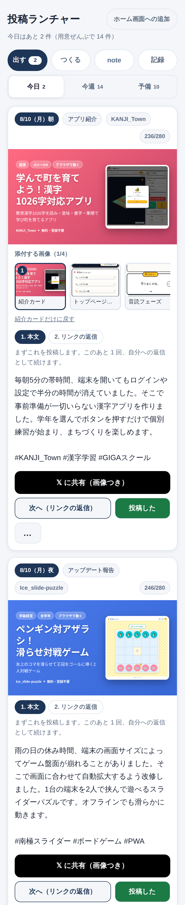

今日の下書き。日付と型とアプリ名が上に、そのまま出せる文章が下にあります。

一枚のカードには、いつ出すつもりのものか、どういう切り口の文章か、どのアプリの話かが最初に出ます。その下に紹介カードの画像があり、さらに下に本文があります。文字数は数えたものが右上に出るので、書き足しても上限を超えたかどうかで迷いません。

何を話題にするかは、その週の学校の様子から決めています。学校の一年はだいたい毎年同じ形をしているので、いつごろどんなことに追われるのかをあらかじめ持たせてあります。所見に追われている十二月に運動会の話をしても読まれないからです。その年その週にだけ起きていることは、別に調べて材料に加えています。ただしそれは題材を選ぶための材料であって、ニュースの解説を書く場所ではありません。

切り口は七つ用意してあり、同じ型が続かないように順番を散らしています。同じアプリの話が数日のうちに何度も出ることも避けています。似たような文章が並ぶと、読む側にとっては同じものが二度流れてきたのと変わらないからです。過去に出したものと言い回しが近すぎるときは、書きなおさせる形にしてあります。

添付する画像は選べます。既定では紹介カードの一枚だけが選ばれていて、タップすると四枚まで足せます。候補には、アプリを実際に操作して撮った画面も並びます。記事のために撮った画面がそのまま使えるので、宣伝用に撮り直す手間がありません。

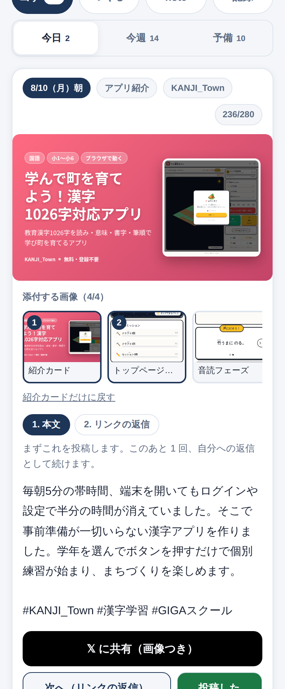

添付する画像。タップした順に四枚まで付きます。

文章のなかにはリンクを入れていません。リンクのある投稿は表示が大きく減ってしまうので、リンクは自分の投稿への返信として、あとから置く形にしています。費用の面だけを見ればリンクを本文に入れても困らないのですが、読まれないなら出した意味がないと考えました。ランチャーは一本目の本文と二本目のリンクを別々のこまとして持っていて、押していけばその順に出せるようになっています。

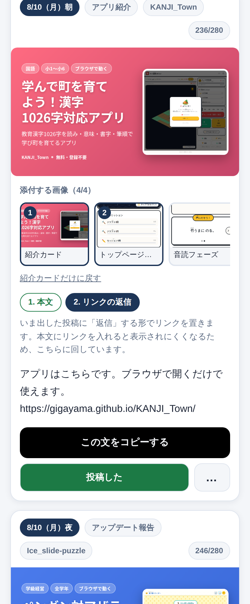

二こま目。一本目を出したあと、返信としてリンクを置きます。

カードにいつも出ているボタンは、共有と、次のこまへ進むものと、出し終えたことを記録するものだけです。たまにしか使わないものは、点が三つ並んだボタンの中にまとめてあります。毎日押す二つと、たまにしか押さない四つが同じ大きさで並んでいると、毎日押すほうを毎回さがすことになるからです。

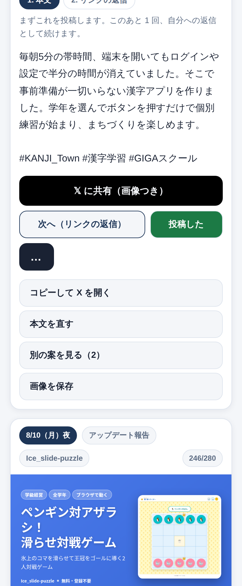

たまに使う操作は、この中にまとめてあります。

その中には、文章を自分の言葉で直す欄もあります。機械が書いた文章はあくまで下書きなので、教室で実際にどうだったかを一文足したいときや、言い回しを自分の口調に寄せたいときに、その場で直せるようにしてあります。むしろ、その一文を足すところが人の仕事だと考えています。直した内容はその端末のなかだけに残ります。

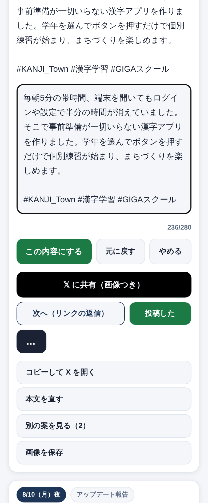

本文を直す。書きかえている最中も文字数を数えつづけます。

文章は一つの枠につき三案書かせて、読者の側に立つ役がそのうち一つを選んでいます。選ばれなかった二案も捨てずに持っているので、読み比べて差し替えることができます。なぜその案が選ばれたのかという理由も一緒に出ます。選ぶ目は書き手のほうが確かなので、機械の判断を最終決定にはしていません。

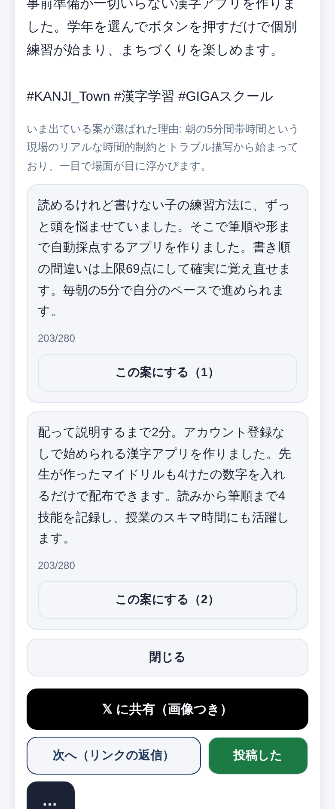

選ばれなかった案。理由を読んでから差し替えられます。

用意された文章は、出る前に一度検査を通しています。子どもたちや学校が特定できる書き方になっていないか、根拠のない言い切りが混ざっていないか、長さは収まっているか、本文にリンクが入っていないか。押した瞬間に出るものなので、あとから直す機会がありません。だから、選ばれた案にも、選ばれなかった案にも、同じ検査をかけています。

今週ぶんをまとめて見ることもできます。日曜の夜に一週間ぶんが用意されるので、朝と夜の二本ずつ、七日ぶんで十四本が日付の順に並びます。忙しい週になりそうなら、先に何本か出しておく、という使い方もできます。

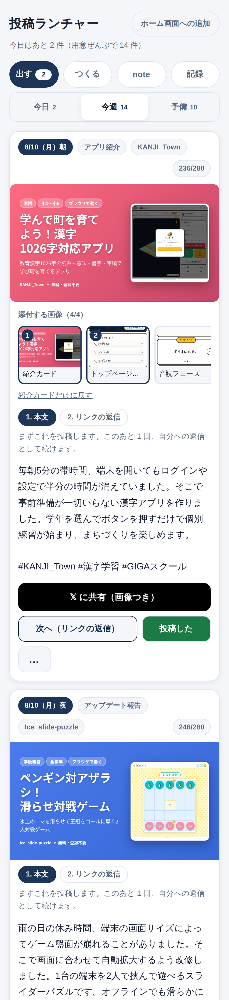

今週ぶん。朝と夜の二本ずつ、七日ぶんが並びます。

予定に無い日のために、日付を持たない作り置きも用意されています。急に一本出したくなった日や、その週の下書きを使い切ってしまった日は、ここから選べば話題を考えずに済みます。切り口で絞りこめるので、続けて同じような文章が並ぶことも避けられます。

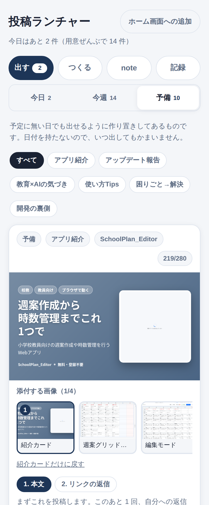

予備の下書き。日付を持たないので、いつ出しても大丈夫です。

## 🕒 予定に無い日でも、その場で作らせる

上の流れは日曜の夜を起点にしています。ところが、このアプリの話をいま出したい、という気持ちは予定と関係なくやってきます。同じ学年の先生に聞かれた日や、その教科の研究授業が近い週は、機械が決めた順番よりも、いま自分が出したいものが先にあります。

そこで、アプリを一つ選んで、本数と切り口を決めて頼めるようにしました。五十二件の中から名前や教科や学年でさがせるので、名前をうろ覚えでも見つかります。

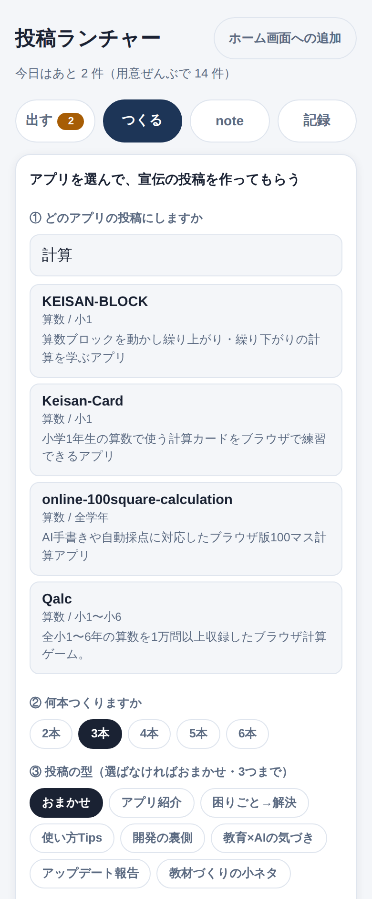

作りたいアプリをさがす。教科や学年でも見つかります。

何本つくるか、どういう型で書くか、どんな切り口がよいかを決めて頼むと、一分か二分でその端末に並びます。型は選ばなくてもかまいません。二学期のはじめに使う場面で、低学年の先生に向けて、といった注文を文章で書き添えることもできます。文章を作るための鍵を画面の中に置くわけにはいかないので、注文はいったん外へ送り、できあがったものを受け取る形にしています。押してから並ぶまでに少し間があるのは、そのためです。

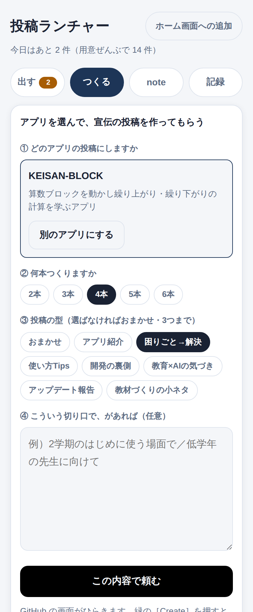

本数と型を選び、切り口を書き添えて頼みます。

型をおまかせにしたときは、更新のお知らせという型を候補から外しています。最近直したところが無いアプリでその型を選ぶと、事実でない文章ができあがってしまうからです。最近手を入れたアプリのときだけ、候補に戻ります。

返したい相手の投稿を貼りつけて、返信の下書きを頼むこともできます。立ち位置の違う案が三つ返ってくるので、そのまま出すのではなく、選んでから自分の言葉に直す前提の道具です。作らせた投稿はその端末に貯まるので、好きなときに出せます。

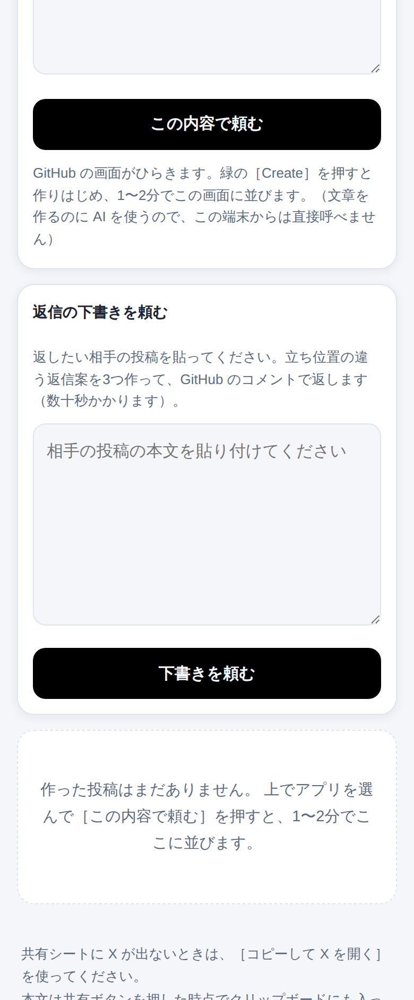

返信の下書き。立ち位置の違う案が三つ返ってきます。

## 📚 書き上げてある記事を、貼れる形にして運ぶ

アプリを作ったときに、そのアプリのファイルを置いてある場所の中で、紹介の記事まで書き上げていることがあります。実際に操作して撮った画面が何十点も一緒に入っていて、機械が書いた下書きよりずっと中身が濃いのに、これまでは手作業のまま置きっぱなしになっていました。

いまは、それを見つけて、貼れる形にして運んでくれます。本文は note に貼りやすい形に直したものをまとめてコピーでき、書き方が連載の決まりから外れているところは、直さずに指摘だけを添えて出します。人が書いたものを機械が直すと、直した理由が本人に伝わらないまま文章だけが変わってしまうからです。直すかどうかは、書いた本人が決めることだと考えています。

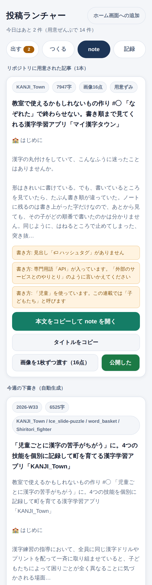

用意された記事。字数と画像の点数、書き方の指摘が並びます。

note には画像をまとめて上げる口がないので、画像は一枚ずつ共有シートに渡す形にしました。本文には画像の番号が目印として残っていて、画面に出る番号と一致します。十数点から何十点もある記事では、いまどれを上げているのかが分からなくなりがちなので、渡し終えたものに印を付けられるようにしてあります。画像のすぐ下に置く一文も、note のキャプション欄に貼れるように別に取り出してあります。

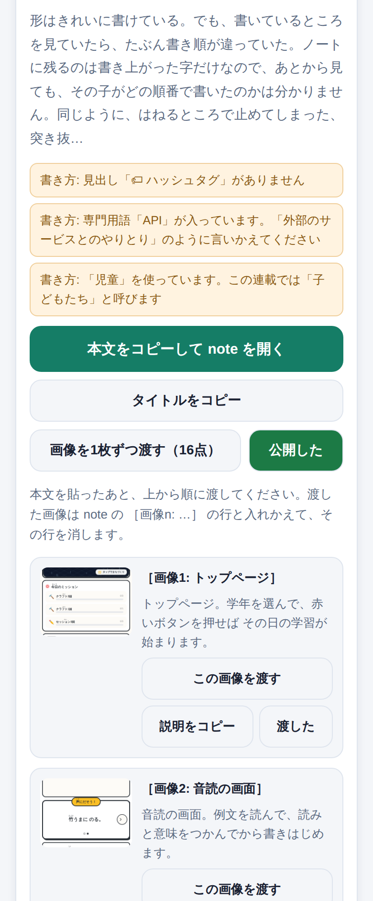

画像は上から順に一枚ずつ。番号は本文の目印と同じです。

画像そのものは、この道具の中に取りこまず、それぞれのアプリの置き場から直接読んでいます。一本ぶんで何メガバイトもあるものを毎週かかえこむと、そのぶん全体が重くなるからです。そのかわり、圏外では画像を渡せません。

書き上げた記事が無いアプリのために、週に一本ぶんの下書きも自動で用意されます。こちらはそのまま出すものではなく、書き出しに困ったときの土台として使うつもりのものです。

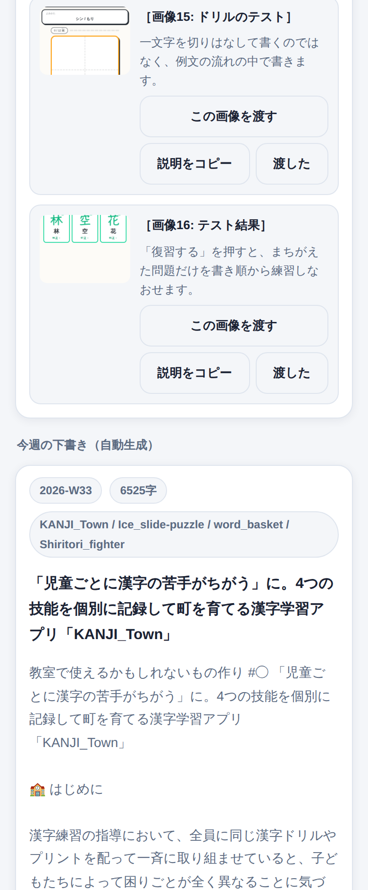

自動で用意される下書き。土台として使います。

## ✨ 導入のメリット

三つのいいことが期待できます。

一つ目は、何を書くかで手が止まらなくなることです。下書きが先にある状態で一日が始まるので、考える時間がまるごと要らなくなります。決めるのは出すか出さないかだけになり、放課後の疲れている頭でも判断できる大きさになります。作るところで力を使い切ってしまい、届ける前に終わってしまう、ということが起きにくくなると思います。何もない白い画面に向かうのと、書かれたものを読んで直すのとでは、必要な気力がまるで違います。

二つ目は、出したあとの手ごたえが次に返ってくることです。出し終えたものに印を付けて、反応がよかったものにもう一つ印を付けると、その記録が翌週の題材の選びかたに効きます。反応がよかったものは、しばらく間をあけてから、そのとき選ばれなかった別の案の言い方で出しなおされます。同じ文章をもう一度出すのではないので、読んだ人にとっても新しく読めますし、作りなおす手間もかかりません。どんな切り口が届きやすいのかが、続けるうちに少しずつ形になっていきます。

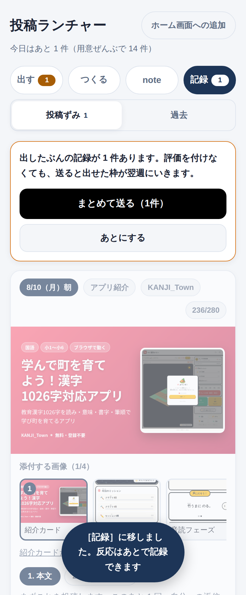

出したぶんの記録。まとめて送ると翌週に効きます。

三つ目は、続けるための負担が小さいまま保たれることです。かかる費用は月に0円で、増える作業もありません。下書きが尽きそうな日には作り置きから提案が出ますし、用意する側が失敗した日にはその旨が通知で届きます。気づかないうちに止まっていた、ということが起きないようにしてあります。発信そのものよりも、続いていることのほうが効くと考えているからです。文章の書き方を決めているところは一つのファイルにまとめてあるので、そこを直せば翌週から雰囲気が変わります。うまくいかないと感じたときに、直せる場所が一か所だけというのは、続けるうえでは大きいと思います。

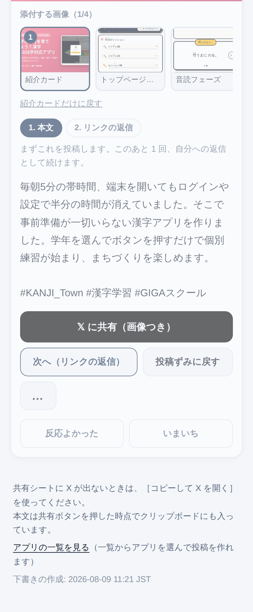

反応の記録。付けなくても送れます。

## 🛠️ 【管理者向け】導入手順

この道具は自分の端末と自分の公開用の置き場だけで動きます。校内の共有ドライブや校務のアカウントは使いません。

用意するものは二つです。一つは文章を作る AI を使うための鍵で、Google の AI スタジオから無料で作れます。カードの登録は要りません。もう一つは公開の設定で、自分の置き場の設定画面から一度だけ有効にします。どちらも画面の指示どおりに進めれば十分ほどで終わります。鍵は公開される場所には置かず、外から読めない場所にしまいます。

その後、用意する処理を一度だけ手で動かします。初回はすべてのアプリを開いて画面を撮るので二十分から三十分かかりますが、二回目からは更新のあったアプリだけになるので数分で終わります。以降は日曜の夜八時に自動で走り、通知は朝六時半と夜八時に届きます。通知を受け取る設定を必ずオンにしてください。ここが発信を続けるための要になります。

スマホでは、開いたあとにホーム画面へ追加してください。ホーム画面に置くと、通知から一回のタップで開けるようになります。追加のしかたは画面の中に書いてあります。

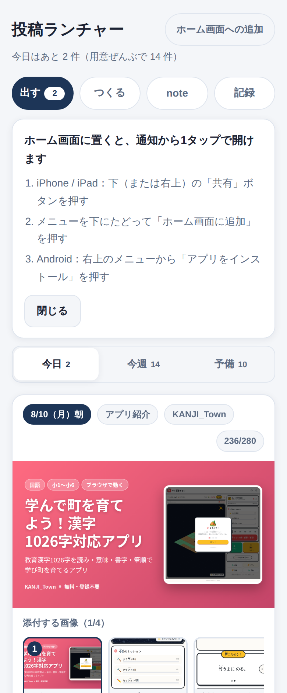

ホーム画面への追加。iPhone と Android の両方を案内します。

X には自動で出しません。X が用意している自動投稿のつながり口は無料の枠が無くなっていて、いまは一本ごとに費用がかかります。とくにリンクを含む投稿は高くつくので、毎日何本も出すと月に数千円になります。かわりに、端末の共有シートを開いて人が投稿ボタンを押す形にしました。note にも自動では出しません。note には正式なつながり口が無く、正式でないものを使うと利用規約に触れてアカウントが止まる可能性があるためです。本業の信用に関わるので、そこは避けています。

校内のフィルタリングを通す必要がある行き先は、自分の公開用の置き場と、画面の画像を読みにいく先と、通知や注文のやりとりに使う場所と、note のエディタです。X に出すときだけ X の画面が開きます。これ以外の外部への通信はしていません。文字の見た目を整えるための外部の読み込みも入れていないので、外部が塞がれている環境でも画面が崩れません。

個人情報は一切扱いません。子どもたちの名前も写真も入りませんし、学校名や自治体名が入らないように、文章を作る側と検査する側の両方で見ています。出したかどうかの印や、直した文章は、その端末のなかだけに残ります。共用の端末では、ほかの人の画面にも同じものが出てしまうので、自分の端末で使うことをおすすめします。別の端末に移したいときは、書き出して読みこむことができます。

電波が届かないところでも、一度開いたことがあれば画面は出ます。文章はクリップボードに入れられるので、電波が戻ってから貼り付けても大丈夫です。ただし画像は外から読みにいくものがあるため、圏外では付けられないことがあります。

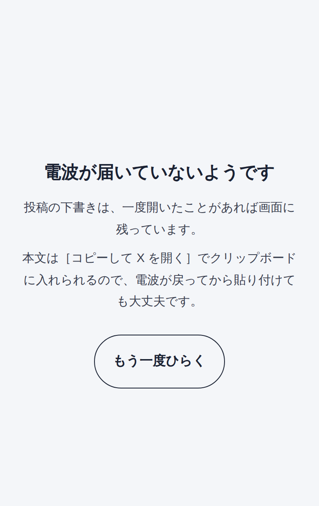

圏外のときの画面。何ができるかを書いてあります。

## 📖 【利用者向け】使い方のガイド

毎日の使い方は、次のとおりです。

1. 朝六時半か夜八時に届く通知を開きます。通知には今日出すぶんの本文がそのまま載っています。
2. 通知の中のリンクからランチャーを開きます。ホーム画面に置いてある場合は、そのアイコンからでも同じ画面が出ます。
3. いちばん上のカードの本文を読みます。直したいところがあれば、点が三つのボタンから本文を直す欄を開いて書きかえます。授業で実際にどうだったかを一文足すのは、ここです。
4. 文章そのものが合わないと感じたら、同じところにある別の案を見るを押します。選ばれなかった二案が理由つきで出るので、そちらに差し替えられます。
5. 添付する画像を選びます。何もしなければ紹介カードが一枚だけ付きます。ほかの画面も見せたいときは、サムネイルをタップして四枚まで足します。
6. Xに共有と書かれたボタンを押します。共有シートが開くので、Xを選びます。画像が付いて本文が入った状態で投稿画面が立ち上がるので、そのまま投稿ボタンを押します。
7. ランチャーに戻り、次へと書かれたボタンを押します。二こま目のリンクの文章が出るので、いま出した投稿への返信としてこれを置きます。
8. 投稿したと書かれたボタンを押します。カードが記録のほうへ移ります。
9. 出し終えたものに反応がよかったという印を付けます。付けなくてもかまいません。まとめて送るを押すと、翌週の題材の選びかたに反映されます。

共有シートに X が出てこない端末では、コピーして X を開くというボタンを使ってください。本文はクリップボードに入っているので、貼り付けるだけで済みます。パソコンから出すときも同じ手順になります。

一日のうちにどちらの枠も出し終えると、今日の欄は空になります。物足りない日は今週ぶんから前借りしてもかまいませんし、予備から一本足してもかまいません。逆に出せない日があっても、翌日に持ち越されるわけではないので、気に病まずに次の日から続けてください。

出したいものが予定に無い日は、つくるという画面からアプリを選んで頼みます。作ったアプリの一覧を見るページからも、選んだ状態でそこへ来られます。

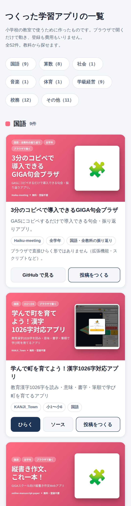

アプリの一覧。教科ごとに数が出ます。

一覧は教科でしぼりこめます。話を出したいアプリが決まっていないときは、ここから眺めて決めるのが早いと思います。それぞれのカードから、そのアプリを開くことも、そのアプリの投稿を作らせることもできます。

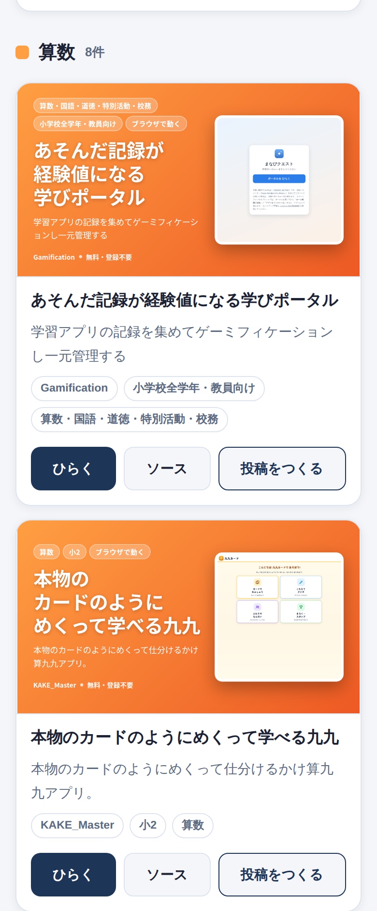

教科でしぼりこんだところ。ここから投稿を頼めます。

## 📝 まとめ

作ったものを届ける作業は、作る作業とは別の力を使います。授業の準備と学級のことで手いっぱいの毎日に、そこまで含めて続けるのは難しいと感じていました。だから、考える手間と書く手間と画像を用意する手間を機械に渡して、人の側には出すか出さないかだけを残しました。

このやり方は、たぶん発信だけの話ではないと思っています。教材でも校務でも、続かないことの多くは、意志が弱いからではなく、毎回同じ準備が発生しているからです。その準備を一度だけ仕組みにしてしまえば、続けるための力はぐっと小さくて済みます。空いた時間は、そのぶん子どもと向き合う時間に回せます。効率よくすることそのものが目的ではなく、そこで生まれた時間を何に使うかが目的です。

同じことは、教室の中でも起きているのだと思います。毎回同じ準備が必要な学習は、子どもたちの側でも続きません。始めるまでの手間をどれだけ小さくできるかが、続くかどうかを決めているように感じます。この連載で紹介してきたアプリが、どれも配って開くだけで始められる形になっているのは、そのためです。

自分の作ったものを誰かに届けようとすることは、少し勇気の要ることでもあります。うまく言葉にできないまま止まっている先生がいたら、まず一本、用意されたものをそのまま出してみるところから始められる道具になればと思って作りました。一歩踏み出そうとする先生を、私はいつでも全力で応援しています。

## 🏷 ハッシュタグ

#小学校 #GIGAスクール #ICT活用 #教員の働き方改革 #自作アプリ #教材づくり #情報発信 #学級経営 #教育とICT #個別最適な学び #先生のための道具 #教員の学び
